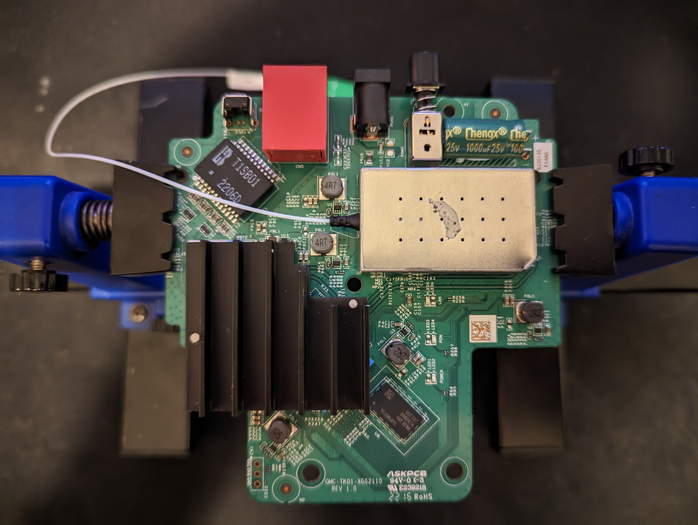
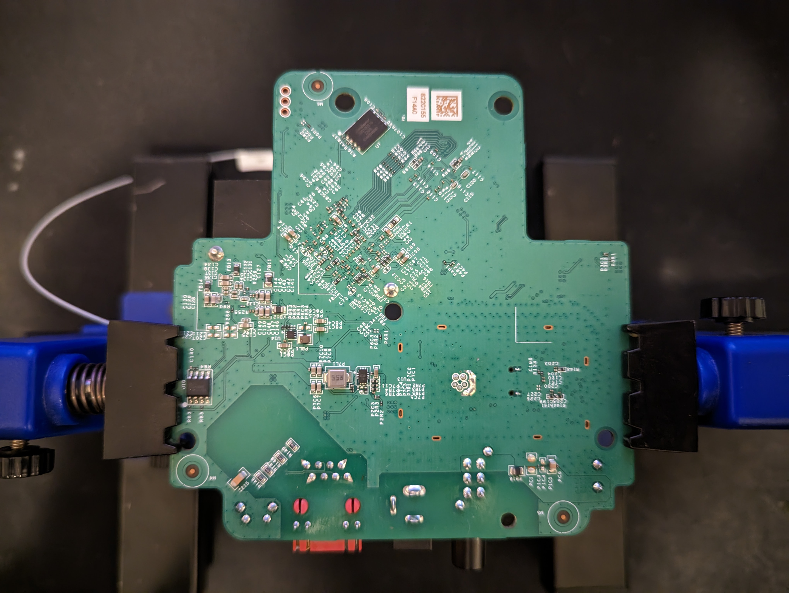

# Genexis XGS2110 Series ONT

Product name: GMC-TK01-XGS2110

[Link to product sheet](./docs/xgs2110-product-sheet.pdf)

## Pictures

### Board top

  
XGS2110 board top picture

  

Points-of-interest:

- UART connector (3 pins), bottom left (see [Findings](#Findings))
- unidentified chip 'k4b2616'(?), bottom right ([pic 01](./pics/unknown-k4b2616-01.jpg), [pic 02](./pics/unknown-k4b2616-02.jpg))
- area under heatsink unexplored

### Board bottom

  
XGS2110 board bottom picture

  

Points-of-interest:

- U10 - mx25l4006e flash chip, bottom left (see [mx25l4006e](./flash/mx25l4006e/))
- U7 - w25n01gvzeig SPI NAND flash chip, top (see [w25n01gvzeig](./flash/w25n01gvzeig/))

## Findings

### UART connector

Settings 115200 8N1 were used connect to the board and find [the boot logs](#Boot_logs)

### Boot logs

Logs were 'cleaned' slightly to allow for diffing.

After booting, the devices lands at a Linux shell: \
`Please press Enter to activate this console.`

- [Boot log.](./logs/cleaned-boot.log)
- [Boot log with the fibre interface connected.](./logs/cleaned-boot-with-gpon.log)

### MAC address / PON serialnumber

The copper interface's MAC address can be read from the PON-SN sticker on the front and back. \
The PON-SN format is: `GNXSiiMACMAC`

Where the number `ii` seemingly translates to the OUI part of the MAC address. \
Using the public listing of [IEEE's MA-L Assignments](http://standards-oui.ieee.org/oui/oui.csv), the order in which the Genexis blocks are registered seem to indicate which OUI to use. \
For instance, if `ii` is `05`, it's the 5th OUI block registered by Genexis.

These are Genexis' OUIs in order in which they were registered:

- 34E380
- BC62D2
- 000F5D
- 000F94
- 580032

### Boa webserver

A Boa webserver (v0.94.13) seems to host the management interface.

Login credentials unknown.
