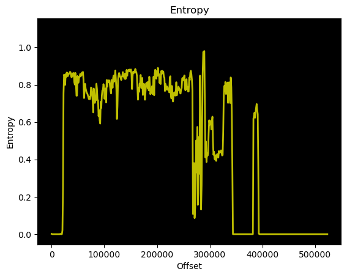

# MXIC MX25L4006E

256MB SPI NOR flash.

[Link to datasheet](./mx25l4006e-datasheet.pdf)

## Memory dump

The [memory dump (.bin)](./mx25l4006e.bin) can be found here.

Seemingly encrypted(?).


### Entropy



### Strings

The only readable string found so far is:

```
v5.5.6 TnW 10GPHY 070521 03:52:14
Rhe-05.05-Candidate6: 2020 Nov 11 10h 44m
```


### firmware-mod-kit / yaffs(2?) 

Using `binwalk` I couldn't find anything useful, so I tried `firmware-mod-kit`.

It resulted in the extraction of what you'll find in the [fmk directory](./fmk/).

Whether or not this is useful, I'm not sure.
